The corresponding software framework could be used to reproduce the experimental study presented in the paper. The framework is designed in a modular manner. The main component is written in Python, while one component is written in Perl. The list of modules is as follows:
- ./features/ – turn-level feature extraction. The module includes three different types of features used in our study.
- ./utils/ - code used to split the dataset-specific feature files into training/test splits – given defined label files, which include information about the WAV file's class label and speaker group/ID (for speaker-independent evaluation).
- ./machine_learning/ - contains codes used for classification and regression tasks
- ./measures/ - contains code for Unweighted Average Recall UAR[%] rates given the ground truth and prediction classes.
- ./labels/ - includes an example of label file for Uni-Bern embarrassment dataset

Due to the General Data Protection Regulation (GDPR) regulation, the Unibern Dataset used for embarrassment analysis could not be shared without signing An end-user license agreement (EULA) with Uni-Bern Representatives. 

Processing flow for reproducing results presented in Section 3.2 

Due to licensing restrictions on the datasets used in our study, we are unable to share the models trained on EMO-DB and VAM database samples. To reproduce the experimental studies presented in Section 3.3 and Section 3.4, researchers must:
- Obtain Dataset Access: Sign an End User License Agreement (EULA) with the respective dataset owners.
- Follow Reproduction Instructions: Adhere to the steps outlined below to replicate our experiments.

Processing flow for reproducing results presented in Section 3.3 : VAM dimensional 

Processing flow for reproducing results presented in Section 3.4 : EMO-DB emotional categories

